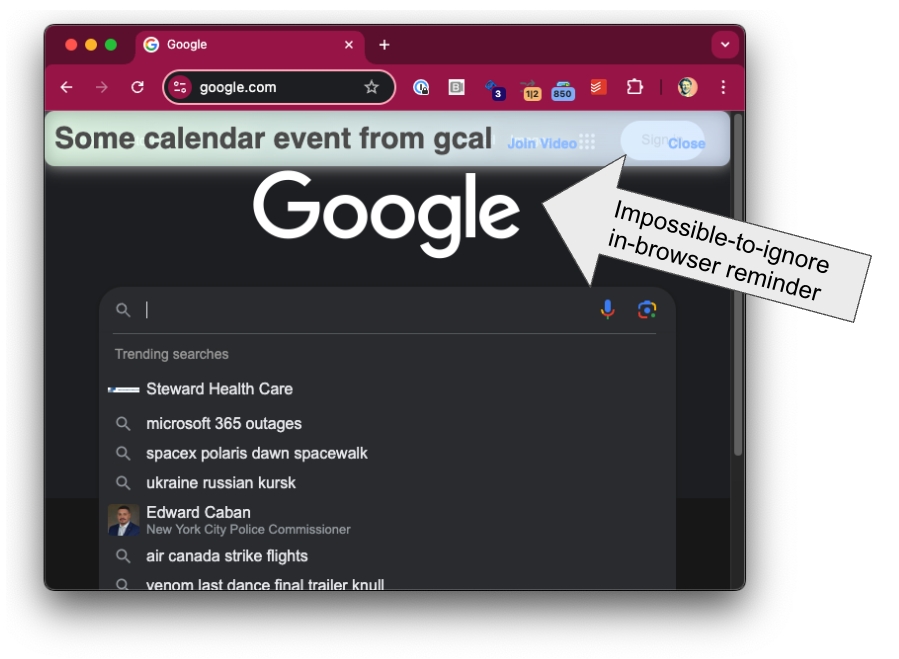

# Todo5 Reminder

Todo5 Reminder is a Chrome extension designed to sync with your Google Calendar events and provide in-browser reminders for events that are currently in progress. This extension helps you stay on top of your schedule by displaying reminders directly in your browser, ensuring you never miss an important meeting or event.

## Features

- Syncs with Google Calendar to fetch upcoming events.
- Displays reminders for events that are currently in progress.
- Allows users to mute specific event reminders.
- Provides a user-friendly interface with clickable links for event details and video calls.

## Installation

1. Clone the repository.
2. Open Chrome and navigate to `chrome://extensions/`.
3. Enable "Developer mode" in the top right corner.
4. Click "Load unpacked" and select the extension's directory.

## Usage

Once installed, the extension will automatically sync with your Google Calendar and display reminders for in-progress events. You can double-click the reminder header to toggle its position on the page. Click "Ignore" on any reminder to mute it.

## Contributing

Contributions are welcome! Please fork the repository and submit a pull request for any improvements or bug fixes.

## License

This project is licensed under the MIT License. See the [LICENSE](LICENSE) file for more details.
